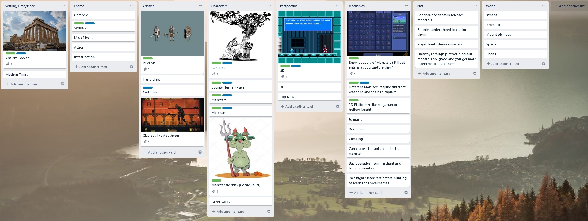
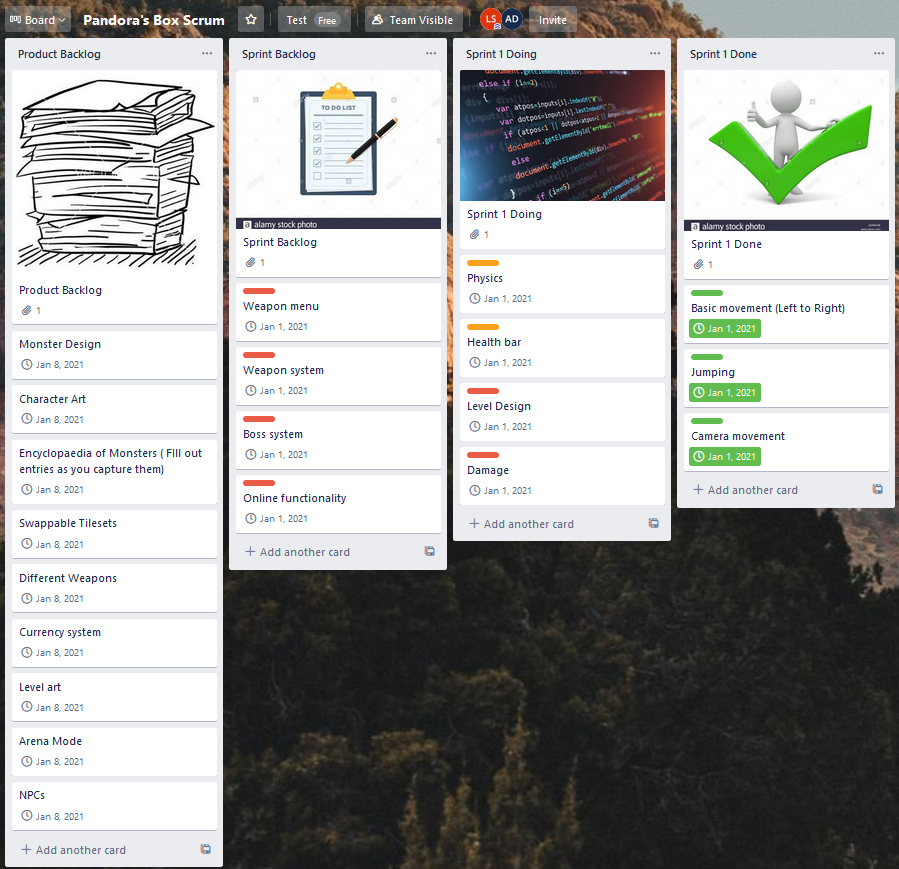

# Deimos by Probably Good Studios
Welcome to our website, so far here we have cataloged the process of brainstorming, pitching and preparing a Scrum chart.
This project is currenty being worked on by Liam O'Shea and Alan Duggan

---

### Brainstorm

This brainstorm took place on the 10th of November and took an hour and a half

[link](https://trello.com/b/d81dQKNz/pandoras-box-brainstorm)

---

### Pitch
Video

[link](https://www.youtube.com/watch?v=pPDvmRVU7VM)

Slides

[link](https://docs.google.com/presentation/d/e/2PACX-1vQWJEB9Wz_-y2kbxJ3rA5ICCyhs8S3QLdeDtp5y7CqM5dNCNdb4ua_uM5C06HkrtAGAT5WVBYw8Fg86/pub?start=false&loop=false&delayms=5000)

---

### Scrum Board and Burndown Chart

## Scrum board

[link](https://trello.com/b/3gl9wrEW/pandoras-box-scrum)
  
## Burndown Chart

[link](https://1drv.ms/x/s!AsPPxQcsz40CgmUDN3qKcbeWiNYT?e=QqeK1F)
---
## Narative
The story of Deimos starts with the protagonist named ’The Hunter’ sparring with his mentor in a field outside of a small Greek village. After returning home, The Hunter finds his village razed by monsters. His family has been killed by a Satyr. The Hunter takes his sword and dispatches the Satyr but alas, he is too late to save his family. On the Satyr’s body, The Hunter finds an insignia. As the character moves onwards, he enters the town which at this point is in ruins.  In the town The Hunter meets Pandora, the woman responsible for releasing the monsters. From here, The Hunter takes bounty contracts for powerful monsters. The Hunter faces increasingly difficult fights against not only the hordes of monsters but the powerful lieutenants of the monster’s forces, however in these areas The Hunter can find powerful weapons to deal with different monsters. At the end of each zone, the monster lieutenants drop insignias and clues which explain why The Hunter’s village was attacked. Through his travels, The Hunter learns that the monsters are being controlled by someone or something known as the Dark Tyrant. After facing down three of the Dark Tyrant’s lieutenants and piecing together the sigil to open the gates of the Dark Tyrant’s lair. The hero is ready to face the mysterious ruler of the monsters. During the fight, the hero is injured, losing an arm and the use of all his weapons other than his sword. The Hunter manages to strike a blow on the Dark Tyrant and knock off his helmet, revealing him to be The Hunter’s mentor. The mentor explains to The Hunter that he ordered the attack on The Hunter’s village, to grow his strength so that The Hunter could replace him as the ruler of the monsters. After killing his mentor, The Hunter has a choice, become the new Dark Tyrant to keep the monsters from running wild or leave and spend the rest of his life hunting down the monsters. 
## Character Profile
Protagonist – The Hunter 

The Hunter Is out on a quest to find out who is responsible for the attack on his village and bring them to justice for killing his family.  The Hunter is bulky man who wears a blue tunic and has long dark hair.  The Hunter will need to gather information through his adventures to find those responsible for the attack.  He is a ruthless warrior that will stop at nothing to get what he wants.  The Hunters goals are to rid the world of the monsters that are set free. 

Antagonist – The Dark Tyrant 

The Dark Tyrant is the leader of all the monsters that have been released.  The Dark Tyrants goals are to rain havoc on the world and to make the hunter powerful enough to replace him as the dark tyrant. The dark tyrant wears a spartan warrior armor and a helmet which conseils his face.   

---
## Level Design
