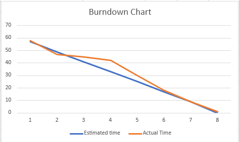

# Deimos by Probably Good Studios
Welcome to our website, so far here we have cataloged the process of brainstorming, pitching and preparing a Scrum chart.
This project is currenty being worked on by Liam O'Shea and Alan Duggan

---

### Trello Brainstorm
[link](https://trello.com/b/d81dQKNz/pandoras-box-brainstorm)

### Pitch
Video

-

[link](https://www.youtube.com/watch?v=pPDvmRVU7VM)

-

Slides

[link]

### Scrum Board and Burndown Chart
[link](https://trello.com/b/3gl9wrEW/pandoras-box-scrum)

-

